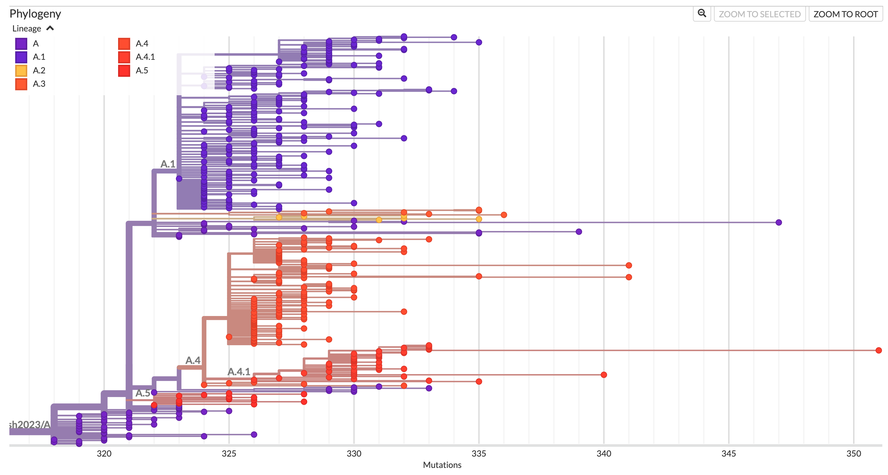

# Designation of the first lineages for the clade Ib outbreak sh2023

This is the first set of lineage designations for the sustained clade Ib outbreak `sh2023`. Until now, only the clade IIb outbreak `sh2017` (the 2022 global outbreak) had sublineages defined in this repository.

The `sh2023` outbreak is the clade Ib outbreak first detected in the eastern Democratic Republic of the Congo (South Kivu) in 2023, which has since been associated with sustained human-to-human transmission and international spread. It was first described in _Sustained human outbreak of a new MPXV clade I lineage in eastern Democratic Republic of the Congo_ (<https://www.nature.com/articles/s41591-024-03130-3>). The outbreak nomenclature follows the paper _A systematic nomenclature for mpox viruses causing outbreaks with sustained human-to-human transmission_ (<https://www.nature.com/articles/s41591-025-03820-6>).

Because this is the first designation round for `sh2023`, we define the outbreak root lineage `A` together with its early diversifying children. Lineage names within `sh2023` are scoped to the outbreak and independent of the identically spelled lineage names used for `sh2017`. For disambiguation, unless obvious from context, the outbreak name should be included when referring to a lineage (e.g. `sh2023/A.1` vs `sh2017/A.1`).

All new lineages follow similar criteria used for `sh2017` designations:

- International spread (not confined to a single country)
- Having at least 1 mutation above the parent lineage
- Containing at least 15 sequences or plausibly representing undersampled diversity
- Clear common phylogenetic structure (no uncertainty about possibly being designated as 2 lineages instead of 1)
- Having at least one openly available high quality reference sequence

Defining SNPs are given with respect to the reference sequence NC_063383 (MPXV-M5312_HM12_Rivers), consistent with the rest of the repository.

## Lineage definitions

Phylogenetic tree of Clade Ib with the newly designated lineages annotated:

### A

A is the root lineage of the `sh2023` clade Ib outbreak. Reference sequences are early cases from the eastern DRC (North and South Kivu). To date, around 250 sequences are part of this lineage (as of 2026-07-06, via Pathoplexus).

### A.1

A.1 is a large (>500 sequences) A descendant defined by G140753A and G186208A. The majority of available sequences are from Kinshasa, but there are also sequences from other regions of the DRC, as well as China, Portugal, Germany, and Canada.

### A.2

A.2 is an A descendant defined by G138816A and C165799T, sampled in Uganda, Canada, the US and Germany. To date, around 15 sequences are part of this lineage.

### A.3

A.3 is an A descendant defined by A54739G and C128447T, sampled in the DRC, South Africa, Malawi, and the USA. To date, around 10 sequences are part of this lineage.

### A.4

A.4 is an A descendant defined by C149636T and G171609A. It is a large lineage (~600 sequences, including A.4.1 - around 470 with A.4.1 excluded) with the majority of sequences from Uganda, but with global spread in more than 10 countries, including India, Thailand, the USA, Germany, among others.

### A.4.1

A.4.1 is an A.4 descendant defined by G3656A and C17707T, with global spread. In contrast to the other lineages, the majority of A.4.1 sequences are from Europe. There are around 130 sequences in this lineage.

### A.5

A.5 is an A descendant defined by C4301T and G127872A. The majority of sequences are from Uganda, but there are also sequences from Germany and Kenya. To date, there are around 70 sequences in this lineage.