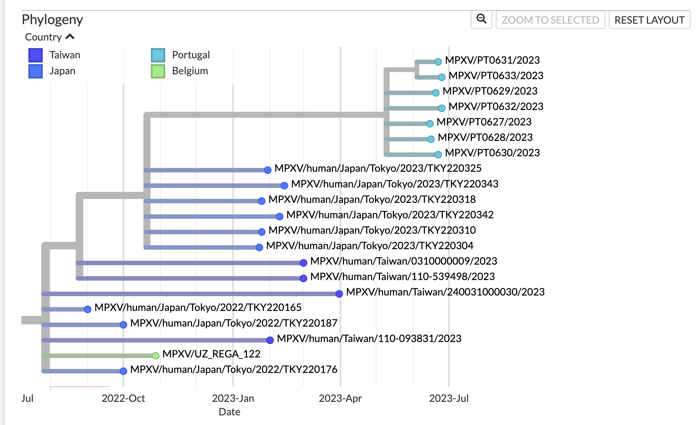
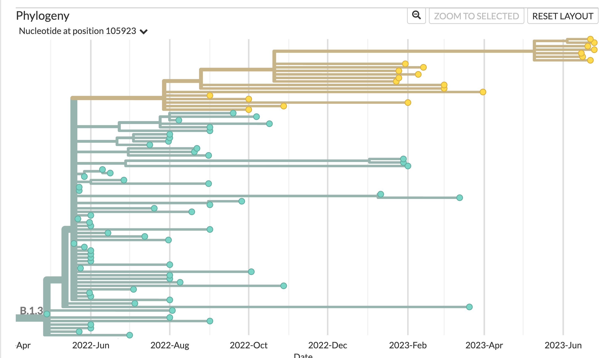

# Designation of three B.1 sublineages and on B.1.3 sublineage

Overall case numbers in the regions most affected by 2022 outbreak (Europe and the Americas) have sharply reduced since the peak in June-September 2022. Two WHO regions that had small case numbers in 2022 have had an increase in 2023: Western Pacific and South-East Asia. Sequence uploads since the last lineage designation in January 2023 have revealed new lineages that are hereby designated as **B.1.18, B.1.19, B.1.20, and C.1 (alias of B.1.3.1)**.

Given the increased number of mutations compared to the outbreak root, single mutations (SNPs) are no longe sufficient to reliably identify lineages. The criteria for lineage designation are therefore made more restrictive to include at least 2 mutations compared to the outbreak root. Otherwise the criteria used to designate these lineages are the same as previously. Lineages for designation require:

- International spread
- Having at least 2 mutation above the parent lineage (increased from 1)
- Containing at least 15 sequences or plausibly represents undersampled diversity
- Clear common phylogenetic structure (no uncertainty about possibly being designated as 2 lineages instead of 1)
- Has at least one freely available high quality reference sequence

#### C.1 (alias of B.1.3.1)

At date of designation, this is a mostly East Asian lineage comprised of at least 21 sequences. 9 sequences are from Japan, 4 sequences from Taiwan, 1 sequence from Belgium and 7 very recently uploaded sequences from Portugal. The lineage is a sublineage of B.1.3, a mostly European lineage.
C.1 (alias of B.1.3.1) is characterized by SNPs `G105923A` (defining), `C64426T` and `G55133A` (shared with most B.1.3), and `G190660A` (defining of B.1.3).
This lineage was externally proposed by @c19850727 in [issue 32](https://github.com/mpxv-lineages/lineage-designation/issues/32).
The `yaml` file can be found [here](../lineages/C.1.yml).

Time-resolved phylogeny of C.1

  
Time-resolved phylogeny of B.1.3 with its sublineage C.1 highlighted in yellow

#### B.1.18

This is a mostly US lineage with the most recent sequences collected in October-November 2022 in Colombia. It comprises at least 79 sequences, 74 of which are from the US and 5 from Colombia.
It is defined by `C141757T`, `C43706T` and `T124690C`.
The yaml file can be found [here](../lineages/B.1.18.yml).

#### B.1.19

This is a European and North American lineage with at least 25 sequences and the most recent sequence collected in November 2022 in Belgium.
It is defined by `C148268T` and `G9963A`.
The yaml file can be found [here](../lineages/B.1.19.yml).

#### B.1.20

This is a US lineage with 19 sequences, with the 8 recent sequences collected in Illinois in May 2023.
It is defined by `G53326A`, `C164385T`, and `C187620T`.
The yaml file can be found [here](../lineages/B.1.20.yml).
